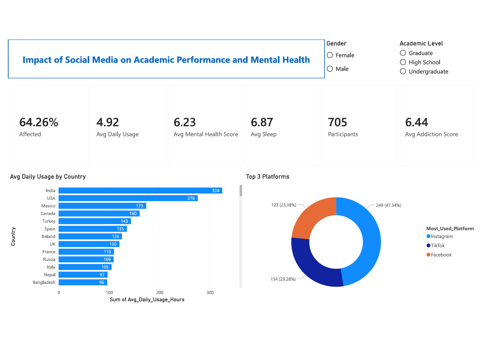

# Impact of Social Media on Academic Performance and Mental Health

## 📌 Business Objective
To analyze the impact of social media usage on students’ academic performance
and mental health, and to provide high-level insights through an interactive
Power BI dashboard to support data-driven understanding and discussion.

---

## 📊 Dataset
Sample dataset representing social media usage patterns and their impact on
academic performance and mental health indicators across different countries
and demographic groups.

---

## 🛠 Tools Used
- Power BI (dashboard development and reporting)
- DAX (KPI calculations)
- Data Modeling
- Data Visualization

---

## 🧮 Data Preparation & Modeling
- Structured and modeled data to support efficient analysis
- Created calculated measures using DAX for key metrics
- Prepared the dataset to enable demographic and country-level filtering
- Optimized the data model for single-page executive reporting

---

## 📊 Dashboard Overview
The dashboard provides a single-page, executive-level overview of social media
usage and its impact on academic and mental health outcomes.

Key features include:
- Social media usage patterns across countries
- Platform-level dominance analysis
- Demographic-based filtering using slicers
- High-level KPI summary for quick interpretation

---

## 📈 Key Metrics
- Percentage of individuals affected
- Average daily social media usage
- Average mental health score
- Average sleep duration
- Average addiction score
- Total number of participants

---

## 🔍 Key Insights
- Higher social media usage was associated with variations in academic
  performance and mental health indicators
- Certain platforms showed higher engagement levels among students
- Demographic filtering revealed differences in impact across regions and groups
- Executive-level KPIs enabled quick comparison and high-level insight

---

## 📸 Dashboard Preview

---

## 📬 Notes
This dashboard was created for portfolio purposes using sample data and is
intended to demonstrate Power BI reporting, KPI design, and data storytelling
skills.
