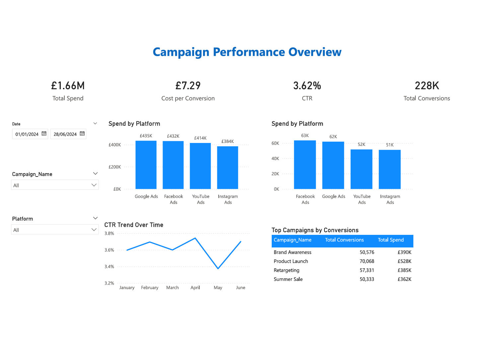
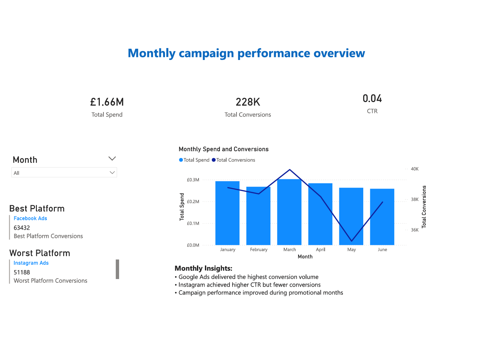

# Marketing Campaign Performance & Media Reporting Dashboard

## 📌 Business Objective
To analyze and report digital marketing campaign performance across multiple
platforms in order to support media agency client reporting and campaign
optimization decisions.

---

## 📊 Dataset
Simulated digital marketing campaign data created to reflect real-world media
agency reporting scenarios. The dataset includes impressions, clicks, spend,
and conversions across platforms and regions.

---

## 🛠 Tools Used
- Excel (data preparation and cleaning)
- SQL (campaign analysis and KPI aggregation)
- Power BI (dashboard development and reporting)

---

## 🧮 Excel – Data Preparation
- Cleaned and structured campaign data for analysis
- Created derived fields such as Month for time-based reporting
- Ensured correct data types for impressions, clicks, spend, and conversions
- Prepared the dataset for SQL analysis and Power BI reporting

---

## 🗄 SQL – Data Analysis
- Aggregated campaign performance metrics by platform and month
- Calculated key KPIs such as CTR and conversion volume
- Identified top and underperforming campaigns using grouping and ranking
- Used SQL analysis to support Power BI dashboard development

---

## 📈 Key KPIs
- Click-Through Rate (CTR)
- Cost per Click (CPC)
- Conversion Rate
- Cost per Conversion
- Total Spend
- Total Conversions

---

## 📊 Dashboard Pages

### 1️⃣ Campaign Performance Overview
Provides a high-level view of campaign performance, including total spend,
conversions, platform comparison, and performance trends with interactive
filters for date, platform, and campaign.

### 2️⃣ Monthly Campaign Performance Report
Designed for client and stakeholder reporting, highlighting month-on-month
performance, best and worst performing platforms, and key insights to support
decision-making.

---

## 🔍 Key Insights
- Google Ads delivered the highest conversion volume across the reporting period
- Instagram achieved higher engagement rates but lower overall conversions
- Monthly performance analysis helped identify underperforming platforms early

---

## 📸 Dashboard Preview

### Campaign Performance Overview

### Monthly Campaign Performance Report

